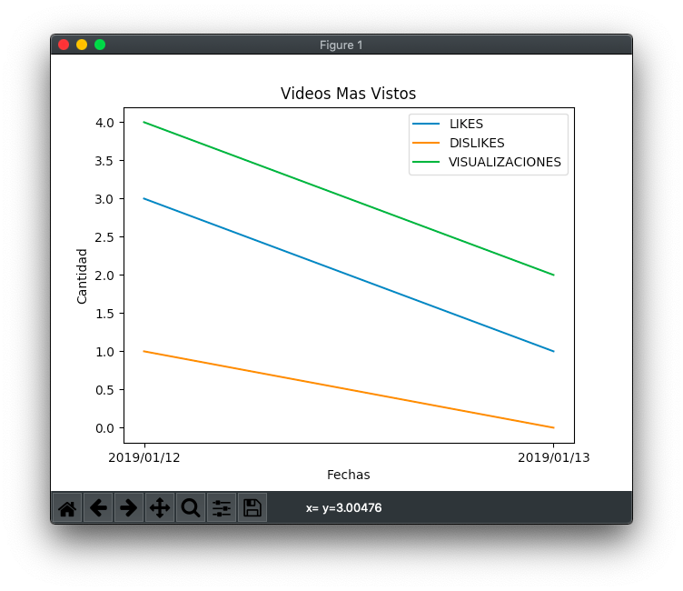

# Ejercicio 2, Segunda PEP 2019-1, FCyP
Este programa es solo una de las múltiples formas de realizar el ejercicio, por ningún motivo significa que sea la única u oficial.
  
Para correr el código utilice su IDE de preferencia o mediante la terminal ejecute  

`python programa.py`

si cuenta con múltiples versiones de python en su computador, debe utilizar la versión 3.7.

`python3.7 programa.py`
  
El resultado obtenido para el contenido de la entrada *pelicula.txt* será el que se puede observar en el archivo restulado.png

